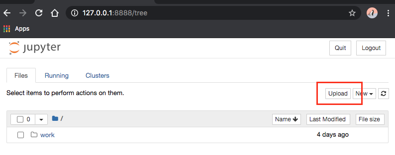
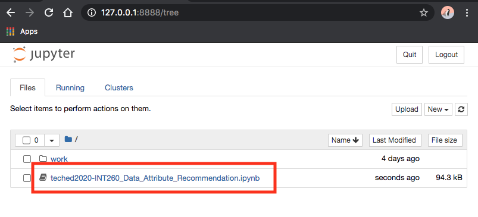

# INT260 - Data Classification with Python SDK and SAP AI Business

## Description

This repository contains the material for the SAP TechEd 2020 session called
INT260 - Data Classification with Python SDK and SAP AI Business

## Overview

This session introduces attendees to the Python Software Development Kit
for the Data Attribute Recommendation service.

## Requirements

**You will need** to have a valid SAP Cloud Platform trial account in the
**Europe (Frankfurt) - AWS** region

See [this tutorial](https://developers.sap.com/tutorials/hcp-create-trial-account.html)
to learn how to create a Trial account. Note that regions other than
**Europe (Frankfurt) - AWS** are currently not supported.

**You will need** an environment where you can run Python code.
This workshop is available as a Jupyter notebook. We recommend that you use a Jupyter
environment to load the notebook and execute the exercises.

### Running Jupyter in Docker

There are several ways to run a Jupyter notebook.
Docker is a great way to quickly get an environment up and running.
For this workshop, we recommend the `jupyter/scipy-notebook` image.

To quickly bring up a Jupyter server inside Docker,
[run the following command](https://jupyter-docker-stacks.readthedocs.io/en/latest/using/running.html):

```bash
$ docker run -p 8888:8888 jupyter/scipy-notebook:latest
```

This will print an URL which will point you to your running Jupyter environment.
There, you can upload this notebook file and execute it.

### Other options for Jupyter

If you cannot run Jupyter locally, there are several offerings available on the
internet. You can use any Jupiter Notebook environment of your choice.

#### MyBinder.org

The `mybinder.org` service does not require prior registration. 
To launch the notebook, follow
[this link](https://mybinder.org/v2/gh/SAP-samples/teched2020-INT260/master?filepath=exercises%2Fteched2020-INT260_Data_Attribute_Recommendation.ipynb).

In our experience, it takes up to five minutes to launch the notebook. 

Sessions on this free service can be terminated after a [brief period
of inactivity](https://mybinder.readthedocs.io/en/latest/faq.html#how-long-will-my-binder-session-last).
It is best not to leave the browser window for long periods of time.

For the same reason, make sure to download your notebook once you are done with the
workshop. The `mybinder.org service` will not keep a copy once your session expires.

If the main link above does not work for you and the notebook is not launching
even after five minutes, you can directly try one of the [following servers](https://binderhub.readthedocs.io/en/latest/federation/federation.html):

* [Binderhub](https://gke.mybinder.org/v2/gh/SAP-samples/teched2020-INT260/master?filepath=exercises%2Fteched2020-INT260_Data_Attribute_Recommendation.ipynb)
* [OVH](https://ovh.mybinder.org/v2/gh/SAP-samples/teched2020-INT260/master?filepath=exercises%2Fteched2020-INT260_Data_Attribute_Recommendation.ipynb)
* [GESIS](https://notebooks.gesis.org/binder/v2/gh/SAP-samples/teched2020-INT260/master?filepath=exercises%2Fteched2020-INT260_Data_Attribute_Recommendation.ipynb)

Using the mybinder.org service is completely voluntary and you are responsible
for any information that you may add to mybinder.org. The reference to the mybinder.org
service is not an endorsement of the mybinder.org service.

#### Google Colab

To launch the notebook in Google Colab,
[click here](https://colab.research.google.com/github/SAP-samples/teched2020-INT260/blob/master/exercises/teched2020-INT260_Data_Attribute_Recommendation.ipynb).

Note that Google Colab requires you to log in. You will be subject
to the terms and conditions and to the privacy policy of Google Colab.

Using the Google Colab service is completely voluntary and you are responsible
for any information that you may add to Google Colab. The reference to Google Colab in
this document is not an endorsement of Google Colab. 

## Exercises

*If you followed one of the links to mybinder.org or to Google Colab, the notebook
will open automatically. You only need to follow the steps below if you have your
own Jupyter instance, such as when running with Docker.*

Start the exercises by downloading the
[Jupyter notebook from Github](https://github.com/SAP-samples/teched2020-INT260/blob/master/exercises/teched2020-INT260_Data_Attribute_Recommendation.ipynb).

Right-click [this direct link](https://github.com/SAP-samples/teched2020-INT260/raw/master/exercises/teched2020-INT260_Data_Attribute_Recommendation.ipynb)
and select "Save As". Save the file to disk.


As an *alternative*, you can download from the command line:

```shell script
wget \
  -O teched2020-INT260_Data_Attribute_Recommendation.ipynb \
  https://github.com/SAP-samples/teched2020-INT260/raw/master/exercises/teched2020-INT260_Data_Attribute_Recommendation.ipynb
```

If you receive a "command not found" error (i.e. on Windows), try curl:

```shell script
curl \
  -L \
  -o teched2020-INT260_Data_Attribute_Recommendation.ipynb \
  https://github.com/SAP-samples/teched2020-INT260/raw/master/exercises/teched2020-INT260_Data_Attribute_Recommendation.ipynb
```

Inside of your Jupyter environment, click the "Upload" button.



In the file selection dialog, select the notebook file. Double-check that the
file name ends with `.ipynb`. If the file has a different extension, please change
the file extension to `.ipynb`. Then click the second "Upload" button:


After the file is uploaded, simply click the file name in the file listing to start the
notebook:



## How to obtain support

Support for the content in this repository is available during the actual time of the
online session for which this content has been designed. Otherwise, you may request
support via the [Issues](../../issues) tab.

## License

Copyright (c) 2020 SAP SE or an SAP affiliate company. All rights reserved.
This file is licensed under the Apache Software License, version 2.0 except as noted
otherwise in the [LICENSE](LICENSE) file.
