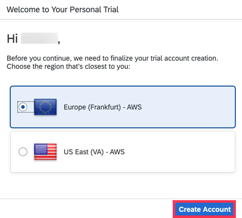

# Creating a new SAP Cloud Platform Trial page

Go to the [SAP Cloud Platform Trial page](https://account.hanatrial.ondemand.com/)
to create your trial account.

*If are participating in the workshop, you should already be able to login to this
page and create your account. If you do not yet have a login, please see the tutorial
["Get a Free Trial Account on SAP Cloud Platform"](https://developers.sap.com/tutorials/hcp-create-trial-account.html)
to learn how to create a Trial account.*

Regions other than
**Europe (Frankfurt) - AWS** are currently not supported. For this reason, make sure
to select the correct region while creating your trial account:

Once you have successfully created your trial account, please proceed
to [Executing the Jupyter Notebook](./README.md#Executing-the-Jupyter-Notebook).
