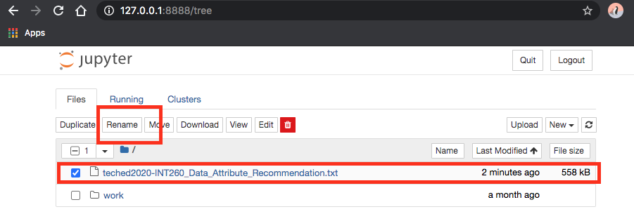

# Running Jupyter in Docker

Docker is a great way to quickly get an environment up and running.
For this workshop, we recommend the `jupyter/scipy-notebook` image.

To quickly bring up a Jupyter server inside Docker,
[run the following command](https://jupyter-docker-stacks.readthedocs.io/en/latest/using/running.html):

```bash
$ docker run -p 8888:8888 jupyter/scipy-notebook:latest
```


This will print an URL which will point you to your running Jupyter environment.
There, you can upload this notebook file and execute it. You can find instructions
to upload the notebook in the [Exercises](#exercises) section.


## Exercises

*If you followed one of the links to mybinder.org or to Google Colab, the notebook
will open automatically. You only need to follow the steps below if you have your
own Jupyter instance, such as when running with Docker.*

Start the exercises by downloading the
[Jupyter notebook from Github](https://github.com/SAP-samples/teched2020-INT260/blob/master/exercises/ex1-DAR/teched2020-INT260_Data_Attribute_Recommendation.ipynb).

Right-click [this direct link](https://github.com/SAP-samples/teched2020-INT260/raw/master/exercises/ex1-DAR/teched2020-INT260_Data_Attribute_Recommendation.ipynb)
and select "Save As". Save the file to disk.


Inside of your Jupyter environment, click the "Upload" button.


In the file selection dialog, select the notebook file. Then click the second "Upload" button:


Double-check that the file name ends with `.ipynb`. If the file has a different
extension, please change the file extension to `.ipynb`. First, select the row
containing the file and then click the "Rename" button. 



Change the file extension to `ipynb`:


After the file is uploaded, simply click the file name in the file listing to start the
notebook:


Once you have launched the notebook, you are all set.
The remaining workshop content is located inside the notebook.
