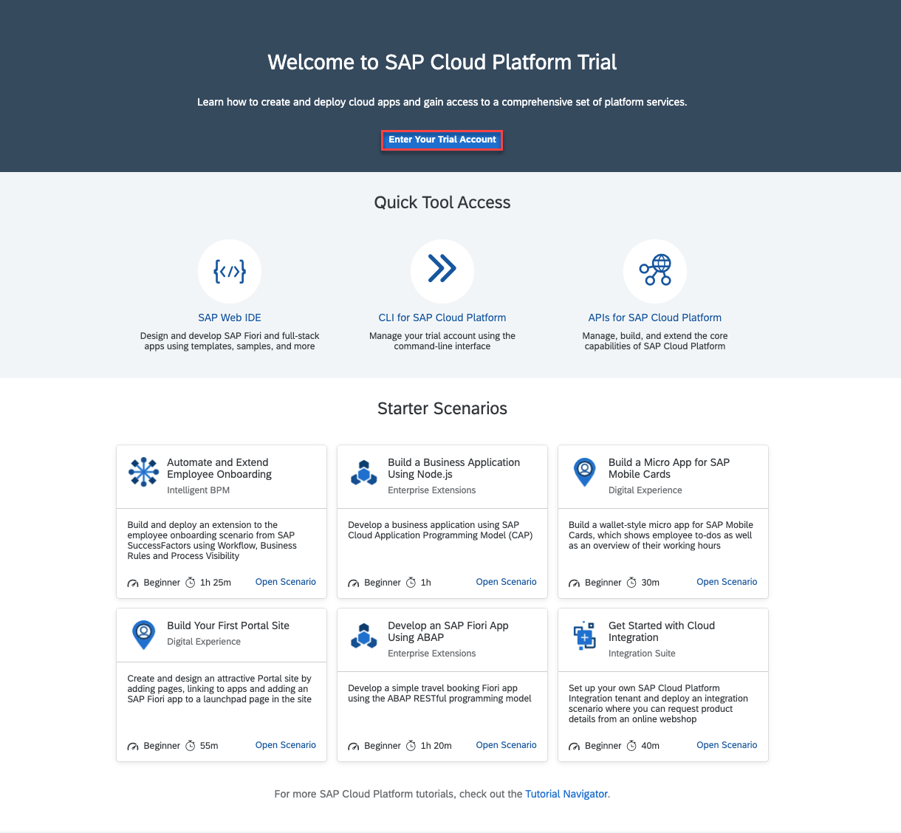
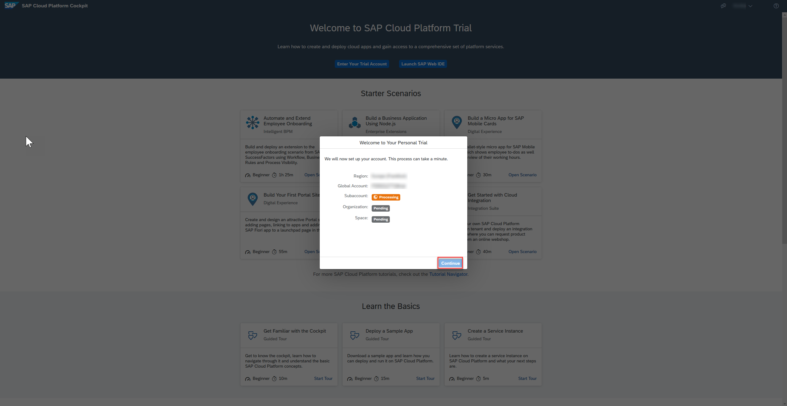
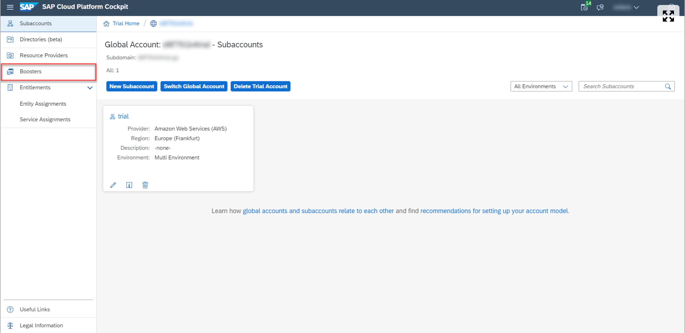
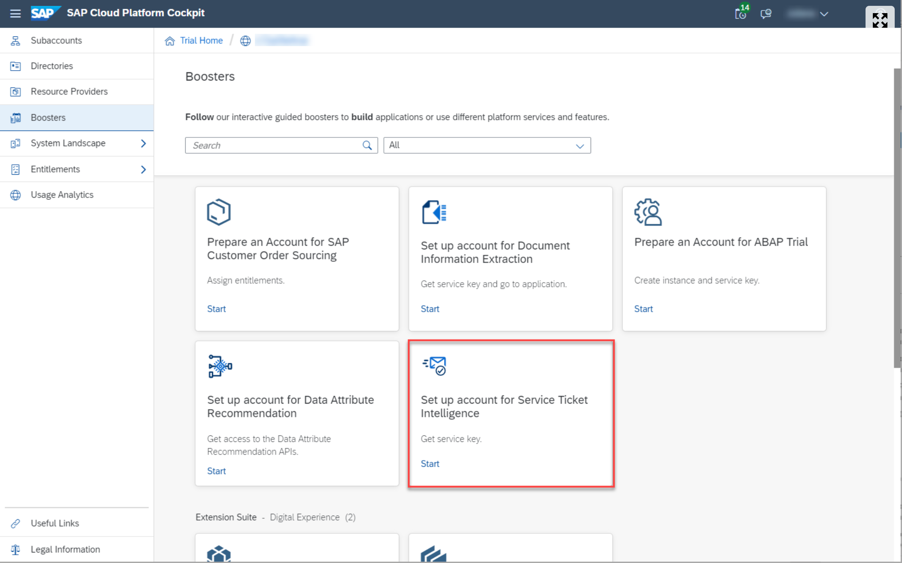
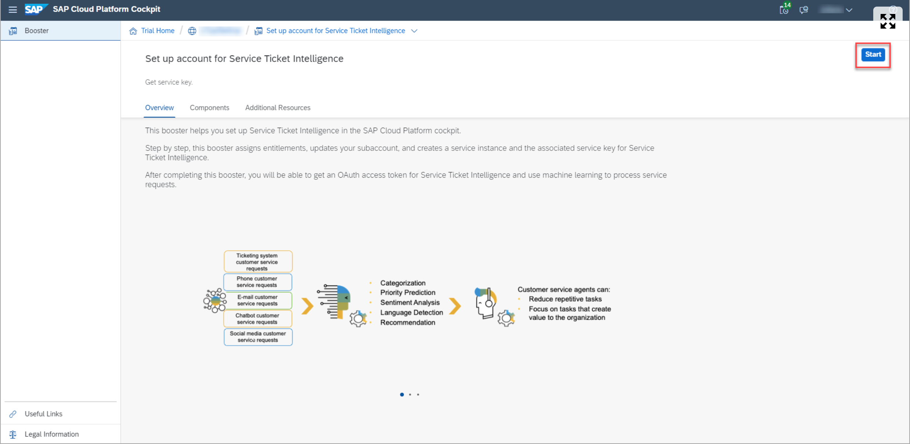
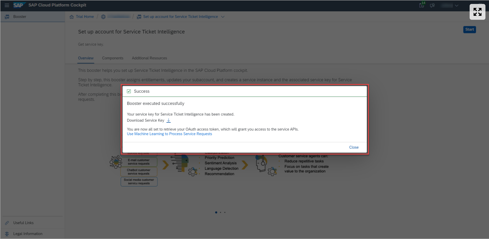

# Exercise 2.1 - Provision instance for Service Ticket Intelligence

In this part of the exercise, we will create a service instance and retrieve credentials of Service Ticket Intelligence in SAP Cloud Platform Cockpit. Credentials are required to authorize and communicate with Service Ticket Intelligence. 

## Steps

### Access SAP Cloud Platform Cockpit

1. In your web browser, navigate to the [SAP Cloud Platform trial cockpit](https://cockpit.hanatrial.ondemand.com/).
   

1. Navigate to the trial global account by clicking **Enter Your Trial Account**.
   1. If this is your first time accessing your trial account, you’ll have to configure your account by choosing a region.
   1. Please select **Europe (Frankfurt)**. Your user profile will be set up for you automatically.
   1. Choose **Continue**.
      

### Run Booster
SAP Cloud Platform creates interactive guided boosters to automate trial cockpit steps, so users can save time when trying out the services.

Now, you will use the Set up account for Service Ticket Intelligence booster to automatically assign entitlements, update your subaccount, create a service instance and the associated service key for Service Ticket Intelligence.

1. On the navigation side bar, click **Boosters**.
   

1. Search for Set up account for **Service Ticket Intelligence** and click the tile to access the booster.
   
   
1. Click **Start**
   1. If you have more than one subaccount, the booster will choose automatically the correct subaccount and space, but this will require that you click Next twice and Finish once, before being able to see the Success dialog box.

### Get Service Key
You have successfully used the booster Set up account for Service Ticket Intelligence to create a service key for Service Ticket Intelligence.

1. Click Download Service Key.
   

1. Make a local copy of the service key. 
   

If you face any issue with the booster setup for **Service Ticket Intelligence**, you can alternatively follow the steps in [Create Service Instance for Service Ticket Intelligence](https://developers.sap.com/tutorials/cp-aibus-sti-service-instance.html) to create a service key for Service Ticket Intelligence manually.
