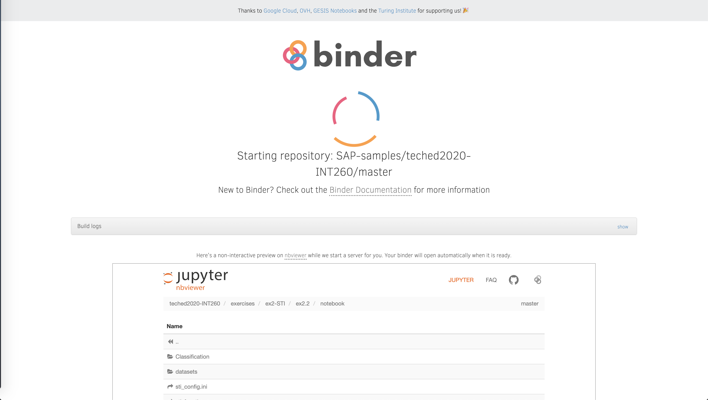
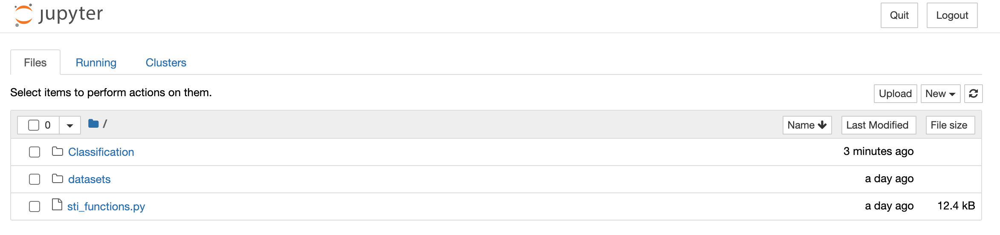
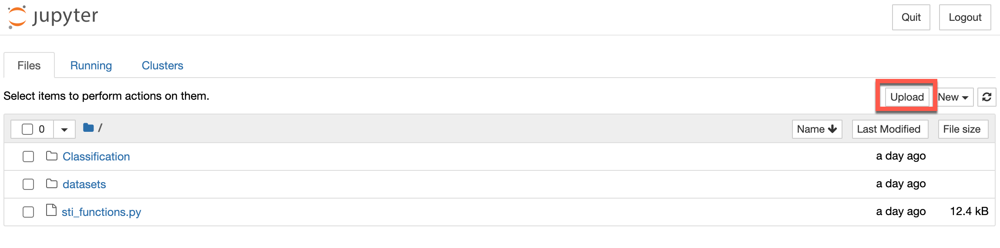
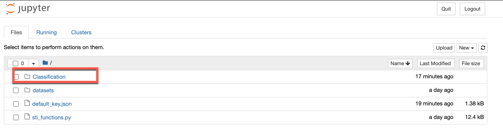

# Exercise 2 - Explore and hands-on with Service Ticket Intelligences' classification scenario 

## Details
Once a service ticket arrives, the machine learning algorithm automatically categorizes it into a certain category with a certain confidence level. Also, the support team assigned and the level of urgency is determined based on the input of the customer request. The system then decides where the tickets need to be routed. As such, a list of tickets is assigned to different functional teams and the customer service agents can immediately start with the most urgent ones.

To fit in specific context, a personalized machine learning model is created for each company, on the basis of a large set of historical data on customer service conversations within the company.

Service Ticket Intelligence offers a range of ticketing classification features:
- Categorization
- Priority Prediction
- Language Detection
- Sentiment Analysis

To explore what Service Ticket Intelligence has to offer, we will be making use of Jupyter Notebooks for this hands-on. Jupyter Notebooks are interactive playgrounds to code and are often used in data science to explore datasets.

Data used for training in this scenario is in the context of complaints from the finance industry.

## Steps

### Launch Juypter Notebooks with Binder
Binder is a web application that allows users to create sharable, interactive, reproducible environments from code repositories.

There are no pre-requisites and no local setup required however, this may take several minutes for the server to launch.

1. Launch Jupyter server with [Binder](https://mybinder.org/v2/gh/SAP-samples/service-ticket-intelligence-jupyter-notebook-sample/master). 
   
   
1. Skip to the [following step](#Add-credentials) once the server is launched.
   

### Launch Juypter Notebooks with locally installed Jupyter Server (Optional)
Alternatively, if you already have Jupyter server installed on your local and you wish to use it, please see the following steps.

1. Clone or download [SAP-samples/service-ticket-intelligence-jupyter-notebook](https://github.com/SAP-samples/service-ticket-intelligence-jupyter-notebook) from the Github repository.
   

1. Start jupyter server by executing the command `jupyter notebook` in your terminal.

1. Proceed with the [next step](#Add-credentials) once the server is launched.
   
 
### Add credentials 
1. In jupyter server, open the `sti_config.ini` file.
   

1. Enter the `sti_service_url`, `uaa.url`, `uaa.clientid` and `uaa.clientsecret` from the previous excercise, save the file and close the window.
   

### Open Classification Scenario in Jupyter notebook
1. In jupyter server, navigate inside the `Classification` folder.
   

1. Open the `Classification_demo.ipynb` Jupyter notebook.
   
   
1. Notebooks contain a number of cells in a sequence whereas each cell mainly contains text or code but can also output diagrams and graphics. If cells contain code they can be executed.

1. The numbers in front of a cell tell the number of executed cells in this notebook. While the cell is being executed a `*` is printed instead of a number so you can tell if the operation is still running or already finished.

1. Once you click into a cell, it is marked with a border so you can tell at which position in the notebook you are.
   
   
1. A cell can be executed by clicking the play button at the top. If you execute code then there will be additional output printed below the cell.
   

## References
More info on jupyter notebooks [here](https://www.dataquest.io/blog/jupyter-notebook-tutorial/)
